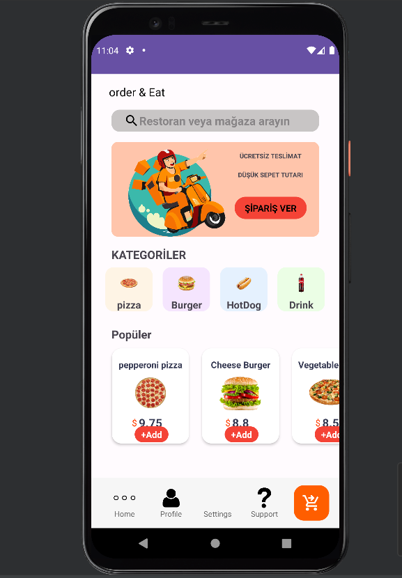
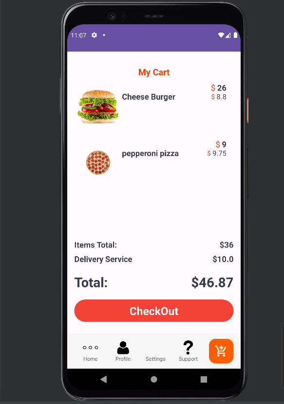
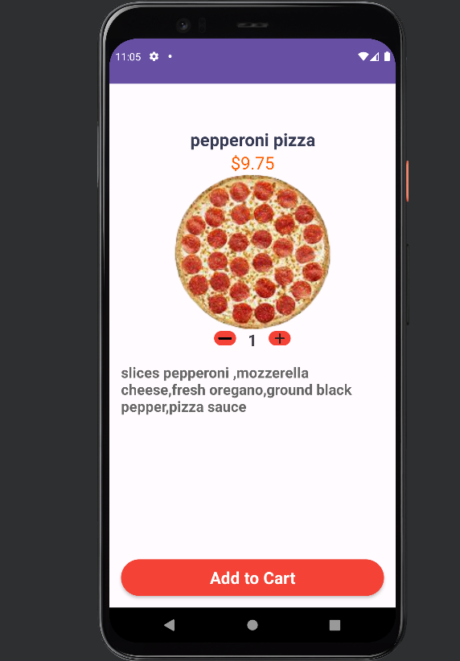

# YemekSepetiClon1.0

## Özellikler

- Restoranları görüntüleme
- Menüleri inceleme
- Sipariş oluşturma ve ödeme işlemleri

## Kurulum

1. Bu projeyi klonlayın:
2. Proje klasörüne gidin:
3. Gerekli bağımlılıkları yüklemek için aşağıdaki komutları kullanın:
4. Uygulamayı başlatın:

## Kullanım

1. Uygulama başladığında, ana sayfada mevcut yemekler ve menüler görüntüleyebilirsiniz.
2. Beğendiğiniz yemekleri sepetinize ekleyebilir ve sipariş oluşturabilirsiniz.
3. Sipariş işlemlerini tamamladıktan sonra ödeme işlemini gerçekleştirin.

## Katkıda Bulunma

Katkılarınızı memnuniyetle karşılıyoruz! Eğer projeye katkıda bulunmak isterseniz:

1. Projeyi çatallayın (fork) ve kendi hesabınıza klonlayın.
2. Yeni bir dal (branch) oluşturarak değişikliklerinizi yapın.
3. Değişikliklerinizi ana projeye göndermek için bir çekme isteği (pull request) oluşturun.

